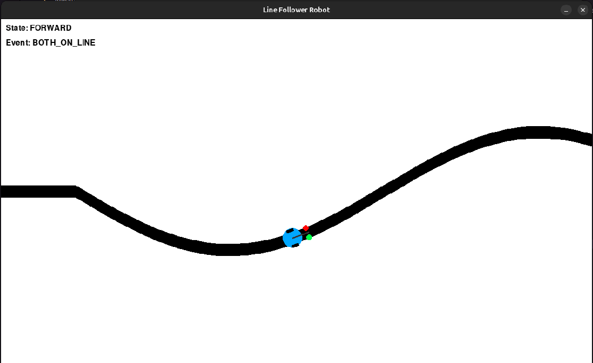

# Line Follower FSM Simulation

This project is a simple **line follower robot simulation** built with **Python** and **Pygame**, using a **Finite State Machine (FSM)** for robot behavior control. The robot can detect a black line using left and right sensors, then decide whether to move forward, turn left, or turn right based on the FSM.

---

## Installation

Make sure you have **Python 3.8+** installed.

Install dependencies:
```
pip install pygame
```

---

## Run the Simulation

Clone this repository and run:
```
python main.py
```
click the close button to exit the simulation window.

---

## Demo

Here’s a preview of the simulation:

